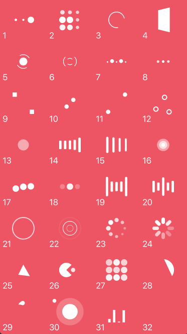

# NVActivityIndicatorView

`NVActivityIndicatorView` is a collection of awesome loading animations.

This is a modernized fork: Swift 6, main-actor isolated, with a built-in
SwiftUI wrapper and accessibility support.



## Requirements

- iOS 16+ / tvOS 16+ / Mac Catalyst 16+
- Swift 6.3 (Xcode 26+)

## Animation types

| Type                   | Type                        | Type                   | Type                       |
| ---------------------- | --------------------------- | ---------------------- | -------------------------- |
| 1. ballPulse           | 2. ballGridPulse            | 3. ballClipRotate      | 4. squareSpin              |
| 5. ballClipRotatePulse | 6. ballClipRotateMultiple   | 7. ballPulseRise       | 8. ballRotate              |
| 9. cubeTransition      | 10. ballZigZag              | 11. ballZigZagDeflect  | 12. ballTrianglePath       |
| 13. ballScale          | 14. lineScale               | 15. lineScaleParty     | 16. ballScaleMultiple      |
| 17. ballPulseSync      | 18. ballBeat                | 19. lineScalePulseOut  | 20. lineScalePulseOutRapid |
| 21. ballScaleRipple    | 22. ballScaleRippleMultiple | 23. ballSpinFadeLoader | 24. lineSpinFadeLoader     |
| 25. triangleSkewSpin   | 26. pacman                  | 27. ballGridBeat       | 28. semiCircleSpin         |
| 29. ballRotateChase    | 30. orbit                   | 31. audioEqualizer     | 32. circleStrokeSpin       |

## Installation

### Swift Package Manager

Add it to `dependencies` in your `Package.swift`:

```swift
dependencies: [
    .package(url: "https://github.com/voyager-software/NVActivityIndicatorView.git", from: "6.2.0")
]
```

## Usage

```swift
import NVActivityIndicatorView
```

### SwiftUI

Use the `ActivityIndicator` view. It has no intrinsic size, so give it an
explicit frame:

```swift
import SwiftUI
import NVActivityIndicatorView

struct LoadingView: View {
    @State private var isLoading = true

    var body: some View {
        ActivityIndicator(isAnimating: isLoading, type: .ballSpinFadeLoader, color: .white)
            .frame(width: 50, height: 50)
    }
}
```

### UIKit

Create the view with its initializer. All parameters other than `frame` are
optional and fall back to sensible defaults.

```swift
let indicator = NVActivityIndicatorView(
    frame: CGRect(x: 0, y: 0, width: 50, height: 50),
    type: .ballSpinFadeLoader,
    color: .white,
    padding: 0
)
```

You can also use it from a storyboard by changing the class of a `UIView` to
`NVActivityIndicatorView` (set the module to `NVActivityIndicatorView`) and
editing `color`, `lineWidth`, and `padding` in the Attributes inspector. The
animation `type` must be set in code.

Control animation:

```swift
indicator.startAnimating()
indicator.stopAnimating()
let isAnimating = indicator.isAnimating
```

> **Note:** Change `type`, `color`, and other appearance properties before
> calling `startAnimating()`.

### Accessibility

The view exposes itself to VoiceOver as a frequently-updating element with a
default `"In progress"` label. Override `accessibilityLabel`, or set
`isAccessibilityElement = false` to opt out.

Set `respectsReduceMotion = true` to freeze the indicator in its initial frame
while the system "Reduce Motion" setting is enabled, instead of looping:

```swift
indicator.respectsReduceMotion = true
```

## Acknowledgment

Thanks [Connor Atherton](https://github.com/ConnorAtherton) for the inspiring
[Loaders.css](https://github.com/ConnorAtherton/loaders.css) and
[Danil Gontovnik](https://github.com/gontovnik) for
[DGActivityIndicatorView](https://github.com/gontovnik/DGActivityIndicatorView).

This is a fork of the original
[NVActivityIndicatorView](https://github.com/ninjaprox/NVActivityIndicatorView)
by [Vinh Nguyen](https://github.com/ninjaprox).

## License

The MIT License (MIT)

Copyright (c) 2016 Vinh Nguyen [@ninjaprox](http://twitter.com/ninjaprox)
